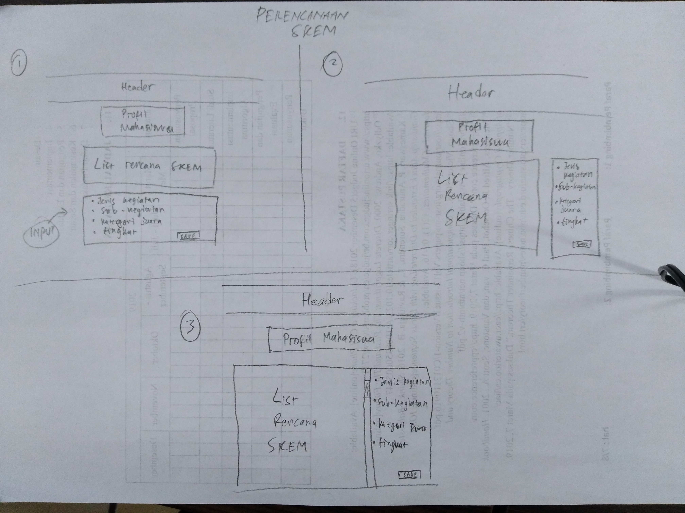
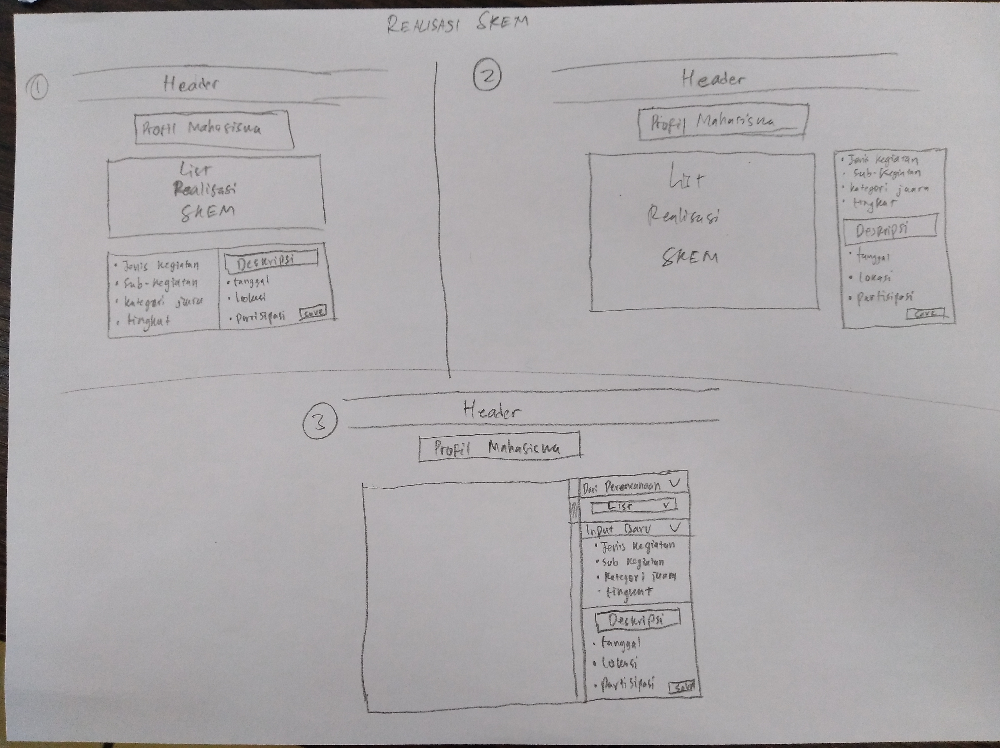

# Sketching and Prototyping
Using the information in the results of Assignment 1 for what is good and bad about the UI for designed tasks, we are going to make **Sketches** and **Prototypes**. These sketches and prototypes will lead to better design in Assignment 3. The prototypes will be then tested through a usability evaluation followed by design revision in Assignment 4.

## Part A: Sketches
Sketch at least **3 (three)** different UIs for the functions you are targeting. These three interfaces should be _dramatically different_ in terms of design directions. For example, they can be with different organizations of what functions on each screen or using a different layout of the icons, widgets, and menus on the screens. If you want, you can also incorporate non-on-screen UIs: physical buttons, gestures through motion sensors, etc.

You need **not** sketch the whole interface. It is not necessary for the sketches to have every function or every function in detail, but there should be enough to show off your general idea. **Be creative!** Draw your idea and label a few of the widgets so we can tell your intent. The goal is to have at least 3 good UIs in *interesting* ways. Sketches should be done on paper with pens and/or pencils (do not use a computer).

### 1. Scan/Photo of Sketches
```
Be sure to label the different versions so you can differentiate them in your discussion. 
If you choose to take a picture of your sketches, please make sure the texts are readable.
```




### 2. Version Differences
Not really significant differences for each version. Only slight redesign and change in placement for each block that appear on the page.

### 3. Selected Sketch
For both problems, I prefer the third version. The scroll bar in the 'Realisasi/Perencanaan SKEM' section makes it looks great and users don't have to scroll the page. As for the input section, the dropdowns are well-categorized and well-placed.

### 4. Design Rationale
The most annoying thing is the dropdown, as my friend complained earlier in my assignment 1. I have designed the dropdowns split into several parts, "Jenis Kegiatan", "Sub-kegiatan", "Kategori Juara/Capaian", "Tingkat". And with that, hopefully the users don't need to scroll a never-ending dropdowns.  
For 'Realisasi SKEM' page, I have added a section where the users can look for what they have added when inserting data in 'Perencanaan SKEM'. Users can easily refer to the data they have inserted without making new one.

## Part B: Assumptions
### 1. Hardware
Since Integra itself is not designed as mobile-friendly, most users use laptop to visit the portal. Thus it is safe to assume that users have screen at least 10" in size.
### 2. Users
This portal is used by students as well as lecturers or department administrators, so user experience may vary. But at the very least, the users have adequate experiences in browsing a website and know how the components (the UI) should work. The students, lecturers, or department administrators have used laptops/PCs in their daily basis.

## Part C: Prototypes
High Fidelity Prototype (Freehand): [here](https://invis.io/8CR8KHKP9B2)  
High Fidelity Prototype (Newer)   : [here](https://invis.io/YNRC0AIZS97)  
